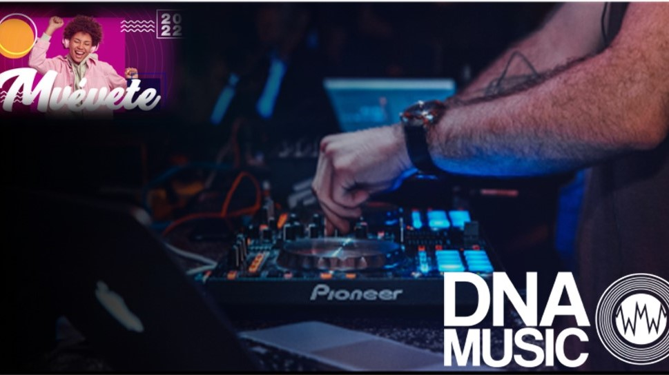
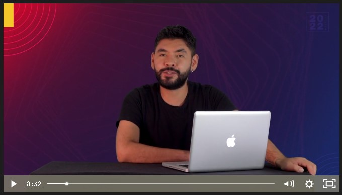
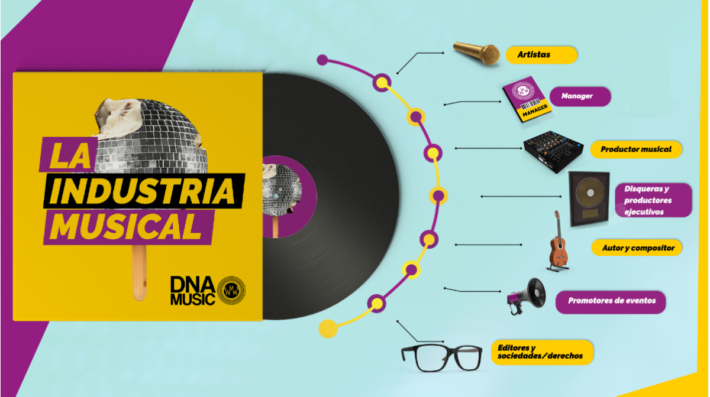
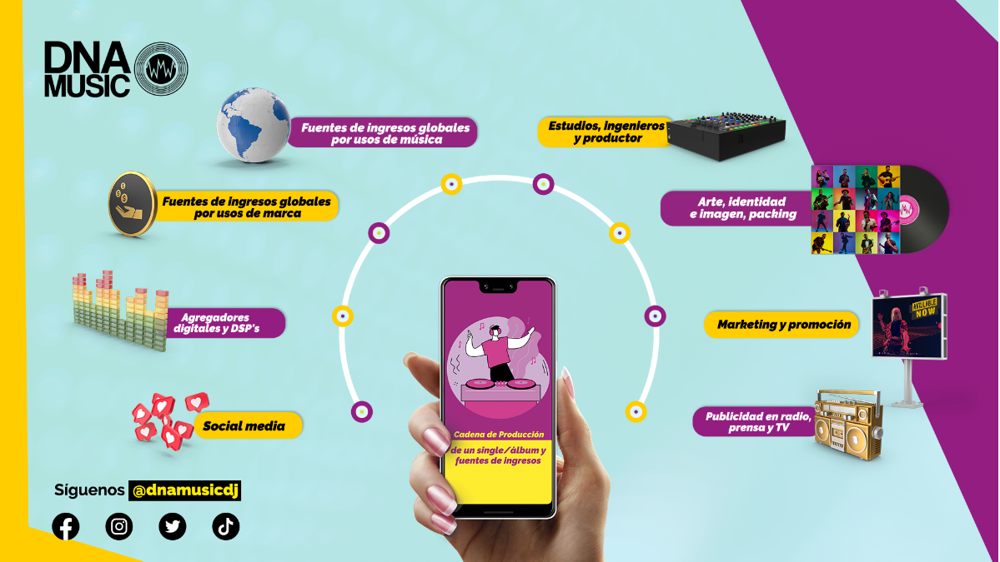
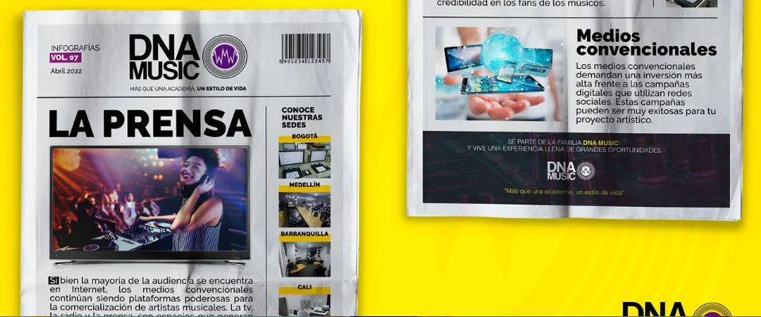

# Muevete - Programa de formación en producción y emprendimiento musical
.webp)
Video introducción @SAMTAPIAS

   * Desde que nacemos los  sonidos nos rodean.
     * Cada uno de esos sonidos se van volviendo música en nuestas mentes. Cada uno de esos sonidos se van convirtiendo en **La Banda sonara** de situaciones muy específicas y especiales de nuestra vida.
    
     * Esos cantes que seguimos, esos artistas se van convirtiendo en un referente, en un ejemplo de vida, en un ejemplo de proyección profesional.
    
     * Formar y proyectar la carrera artistica. Así mismo, se va identificar los diferentes agentes que existen dentro de la industria musical:

         * Artistas 
         * Mánager
         * Ingenieros 
         * Productores de eventos
    
       Esto con el fin de no solo ser competentes en nuestras canciones, sino también, para autogestionarnos de modo que se tenga una independencia  y una consolidacion cuando se lance un proyecto artístico.

     * Se va apreder a crear como producir música comercial aprendiendo nuestras actitudes y aptitudes.
   * Siempre que se va pensar en la industria de la música se debe pensar en:
   
      * Artista 
      * Público 
    La industria de la música se desarrolla basado en la relacón de estos dos agentes. ¿ Qué impacto o relaición tiene el artista con su público?
     Dado los avances tecnológicos  y la globalización (Desarrollo de la internet) hicieron expandir el campo de acción músical como también las oportunidades comerciales.
        * Ejemplo: Hace algunos años era muy complicado geográficamente poder comercializar un disco pero ahora desde la casa se puede hacer la canción e inmediatamente se puede comercializar hasta el último rincon de la tierra gracias al internet.

        Nosotros vamos a poder hacerlo  por medio de la **composición** y  la **producción**, además, se tendran con el desarrollo de estrategias de **Marketing**, de **Mercado**

        * Colombia se ha convertido en un apicentro de la industria músical con diferentes generos
          * Urbano
          * Popular
          * Pop Urbano
          * Rock
        Se ha hecho visible tanto en america como en el mundo tanto así que ha sido nominados a premios tales como:
        * Grammy anglo
        * Latin Grammys
        * Billboard

        Y han estado en el top de Plataformas Streaming como:
        * Spotify
        * Deezer
        * Amazon Music

 ## **MAPA DE LA INDUSTRIA MUSICAL**

### **El ARTISTA**

Cara visible de la industria de la música que finalmente puede ser  un **Interprete** o un **Autor & Compositor**

*   ***El artista como interprete:*** Interpreta canciones que diferentes autores y compositores ya han realizado  

*   ***El artista como cantautor***/***Solista:*** El artista escribe y compone sus propias canciones incluida la melodía.
Un cantautor por lo general se vincula a una tradición o fall acústica y gusta de interpretar tematicas sociales, políticas, personales y filosoficas.
También existen muchos cantantes de diversos generos que escriben sus propias canciones dedicadas al amor durante un tiempo se denominó  a este tipo de música canción protesta

*  ***¿Qué es un artista?:***
Es la cara visible de la industria de la música. Finalmente es el que esta en los conciertos, ruedas de prensa y en la publicidad. Es quien contiene o interpreta el producto principal de la industria de la música ***las canciones***
### **El MANAGER**

Son personas que se encargan de administrar las relación entre el artista y su fanaticada. Además, se encarga  de las comunicaciones, representaciones  y el equipo de trabajo del artista, la interlocusi+on del sello discográfico y el artist, así mismo, de las diferentes marcas que esten interesadas en el artista

El manager es la fiel representaicíon que puede ser un inversor o alguien que representa el proyecto artistico 

### **LOS PRODUCTORES MUSICALES**

Se encargan de la consolidación de la música del artista, la grabación, los arreglos y las interpretaciones van por cuenta de la operación de los productores musicales. 
En ocaciones pueden ser autores y compositores  o simple mentente operarios dentro un disco o de laconformación de un sencillo de un artista  determinado. *"Director creativo""*

### **DISQUERAAS / PRODUCTOR EJECUTIVO**
Se encargan de la conformación de mercado  de cada uno de los artistas estan en constante comunicación y patrocinio desde el primer momento de la consolidación de un proyecto artistico, de un proyecto musical, de un lanzamiento y de la comunicación  masiva del producto final de un artista.
Las disqueras y los productores ejecutivos son una de las fuentes  de ingresos más importantes de la industria de la música.

### **AUTORES & COMPOSITORES**

Son las fuentes creativas del negocio de la música, fuentes creativas en la composición musical de ellos nacen absolutamente todas las canciones, obras literarias, obras musicales. Los autores y compositores son los agentes que estan detrás, creando música para todos nosotros.

### **LOS BOOKERS**

Son los agentes que se encargan ***Reservar & Administrar*** las fechas de diferentes artistas, a ellos se dirigen los productores de los evenos cuando solicitan los servicios artisticos de determinado cantante o interprete.
Cuando un evento es creado o producido, necesita de comunicación y divulgación masiva para la compra de los tickets, allí es cuando encontramos los **Promotores de eventos** quienes se encargan no solamente de comunicar el artista sino la experiencia que el público va ha vivir dentro del evento.

## **EDITORES Y SOCIEDADES/DERECHOS**

* ### **Editor**

  Un editor musical se encarga principalmente de conceder licencias y administrar los derechos de autor de las composiciones.

  Los derechos de autor de una composición se refieren al conjunto de notas, melodías, frases, ritmos, letras y/o armonías que constituyen la esencia de la obra.

  Por lo general, son responsables de asegurar la colocación de las canciones en el catálogo de la editorial, donde se generarán regalías y otros ingresos.

* ###  **Sociedad de gestión colectiva**
  Son organismos que conceden licencias y reclaman regalías en nombre de los titulares de los derechos de autor por el uso de sus obras.

  Hacerte miembro de una sociedad y registrar tus canciones *permitirá recibir regalías* por el uso que se haga de tu música en público.

* ### **Las principales entidades de gestión de derechos en la música son:**
  1. Las sociedades de gestión de derechos de reproducción mecánica
  Representan y licencian los derechos mecánicos en nombre de sus miembros (letristas, compositores y editoras musicales).
  Recaudan regalías por la reproducción de las obras de sus miembros.
  Ejemplo; cuando sus canciones se venden en CD, LP o en línea, ya sea por descarga o reproducción.

  2. Las sociedades de gestión de derechos de representación
  Representan y licencian derechos de ejecución en nombre de sus miembros (letristas, compositores y editoras musicales), para la interpretación pública y la difusión de las obras de sus miembros.
  Ejemplo: cuando las canciones se reproducen en la radio, ya sea digital o terrestre, en línea, se interpretan en locales o clubes en vivo, se reproducen en negocios como música de fondo o se difunden en la televisión.

  3. Las sociedades de gestión de los derechos conexos
  Representan y licencian los derechos de la música grabada (grabaciones sonoras), reproducida en público o difundida en la televisión o en la radio en nombre de sus miembros (intérpretes y discográficas).
  Hacerte miembro de una sociedad y registrar tus canciones te permitirá recibir las regalías pertinentes por el uso de tu música en público.

## **Cadena de producción de un single/álbum y fuentes de ingresos**
 

* ### **SOCIAL MEDIA**
  
   
   * #### **Las redes sociales**
     Abreviaron los procesos publicitarios de un artista musical.
     Expandieron los proyectos en proporciones inimaginables.
     Rompieron con las barreras geográficas.
     Disminuyeron los presupuestos de propagación de información.
     Son parte fundamental en la conformación y consolidación de tu proyecto musical.
     Sirven para conseguir capital y reinvertir en tu proyecto.
   * #### **La autogestión** 
     Consiste en apropiarte de los canales de divulgación digital y hacer un trabajo diario para capturar tus “fans” por medio de la conexión de tu vida como artista.

     Con tu estilo, tu música y tu esencia, puedes conectar con personas que se convertirán en potenciales seguidores para llenar tus conciertos, comprar tu mercancía y publicar tus canciones.
  
* ### **AGREGADORES DIGITALES Y DSP'S**
  El producto principal entre la relación de un artista y un público es nuesta canción, realmente es el producto principal, el producto de comercialización, la moneda de cambio que tenemos dentro de la industria. La canción, La producción.
  La canción tiene tres parámetros fundamentales:
   * **OBRA LITERARIA:** En la obra literaria encontramos o identificamos todo lo que tenga que ver con la liríca, la rima y la poesía de la misma canción.

   * **OBRA MUSICAL:** Todo lo que tiene que ver con la obra musical encontramos los arreglos y la composición y porsupuesto todo plasmado bajo una partitura.

  Al final de la ***obra literaria y musical*** encontramos encontramos el **FONOGRAMA**. El ***fonograma*** es básicamente el proyecto musical consolidado.
  Ese archivo digital que encontramos, anteriormente análogo pero en este momento digital.
  Ese es nuestro fonograma, el proyecto musical consolidado que en conjunto con el autro y compositor, el productor musical, el artista, los interpretes se llego bajo un proceso de grabación y de composición a ello.
  Nuesto fonograma es nuestro producto principal que equivale a la canción y se transforma en un negocio que involucra muchas personas. De esta forma logramos conocer los principales roles y responsabilidades en la industria de la música, ahora debemos ver cual es el desarrollo de una producción de un **sencillo** comenzando desde su pre-producción hasta su comercialización ahí encontramos diferentes agentes que son los estudios, ingenieros, los productores musicales, interpretes. luego de esto le damos una conceptualización a la canción donde encontramos:

    * EL arte 
    * El packing
    * El diseño y toda la parte visual 
      
  posterior a esto la producción del mismo, la comercialización y la prensa (diferentes canales de difusión). Depués de esto también se puede apoyar en herramientas de social media y por supuesto llegar a las plataformas de streaming para que todos puedan eschar nuestra música acá encontramos **la cadena de producción de un sencillo**

* ### **FUENTES DE INGRESOS GLOBALES POR USOS DE MARCA**
  Luego de la creación y consolidación de mi sencillo puedo tener diferentes fuentes de ingresos para mi proyecto artistico como artistas musicales podemos ganar regalias por nuestras canciones pero también podemos tener diversidad en nuestras fuentes de ingreso.
  * #### **EL MERCHANDICE:**
    Es como su nombre lo indica a su traducción, es la mercancia de mi conceptualización visual:
    son todos los sacos,chaquetas, gorras, botones o accesorios que yo hago alrededor de mi proyecto artistico, esto me permite tener una fuente de ingresos para reinvertir  a mi carrera musical para poder perfeccionar mi grabación, mi producción. Para poder invertir en mis performance o shows en vivo ó simplemente para invertir en estrategias de marketing para la comercialización de mi música. Es una buena estrategía para cualquier tipo de artista pues sirve como fuente de ingreso sino también para un proceso de consolidación con mi ***FAN BASE*** una base de datos de mis seguidores a los cuales le gusta mi música, les gusta mi concepto visual y gracias a ellos puedo consolidarme financieramente para reinvertir  en mi carrera y de esta foirma perfeccionar esos factores muy importantes como mi presencia en redes sociales, estragias de marcketing, shows envivo o la comercialización de mi música.
  * #### **LOS SPONSORS:**
    Es una modalidad de fuentes de ingresos sobre todo para proyectos artisticos de medio y de alto nivel.
    Los sponsors son la actividad que tiene una marca muy reconocida dentro de un artista.
    Esto quiere decir que una marca muy reconocida (NIKE, ADIDAS y mas) busca a un artista que sea coherente cone el estilo de la marca  y le dice quiero que usted utilce mis prendas y no solo utilizarlas sino también que paga por utilizarlas. Ese proceso de relación comercial se le denomina sponsors
  * ### **ENDORSEMENT O ASUPICIOS:**
    Estrategias comerciales de corto tiempo por ejemplo que taylor swift tome una cocacola
* ### **FUENTES DE INGRESOS GLOBALES POR USOS DE MÚSICA**  
  * #### **Fuentes de ingreso por nuestra música:**  
    LA SINCRONIZACIÓN

    Se refiere al uso de las obras musicales sin modificación para utilizarla en otras obras:
    * Novelas
    * Peliculas
    * Shows
    * Imprenta de cds
    * Reproducciones fonomecanicas

    Uso de la música en diferentes establecimientos de 
    entretenimiento como bases con sistema de regalías
* ### **ESTUDIOS, INGENIEROS Y PRODUCOTOR**
  Dentro de la cadena de desarrollo del productor principal que es la canción hay diferentes etapas:
  * #### ***PRE PRODUCCIÓN:***
    Es cuando se ajuntan un *ARTISTA {cantautor, interprete} + AUTOR {autor o compositor} + PRODUCTOR MUSICAL* en este momento es cuando se empieza a conformar y consolidar un sencillo musicalmente hablando. La pre producción se da cuando hay una idea musical y se quiere consolidar.
    En esta pre producción es donde interactuan tres agentes pricipales.

     * El ARTISTA
     * EL AUTOR Y COMPOSITOR
     * EL PRODUCTOR MUSICAL

    Dentro la pre producción encontramos que quiere decir nuestar canción, que queremos transmitir, cual va ser el ritmo de la canción, situar el género de la canción repecto a nuestro proyecto artistico y por su puesto cuales van hacer los eventos protagonicos musicalmente hablando dentro de la canción.
    Esto se elige en la pre producción:
     * Que tipos de instrumentos vamos a utiliazar
     * Si queremos un interprete.
* ### **ARTE, IDENTIDAD E IMAGEN, PACKING**
  

  * #### **Identidad Visual:**
    La identidad visual es la creación de elementos gráficos que ayudan a comunicar la personalidad del artista o banda, el concepto musical y la autenticidad con la construcción de piezas cómo:
    * La portada para un sencillo.
    * EP o álbum.
    * Sitio web o un lyric video.
  * #### **Un Brief**
    
    Es un documento que ayuda a crear el concepto dando personalidad a las piezas que se realicen. En él, incluiremos toda la información necesaria para ejecutar nuestro proyecto:
    * Portada
    * Piezas promocionales
    * Página web
    * Fotografía o ilustración
    * Colores que representan el sentimiento de la canción
    * Elementos que forman parte de la composición y cómo interactúan
    * Antes de crear un brief pregúntate:
    ¿Qué tipo de impacto queremos lograr en los oyentes?
    Una emoción en especial, despertar curiosidad o generar shock.
  * ## **¡Ten en cuenta!**
    El nicho. ¿Qué grupo de personas se conecta con tu música?

    Es diferente la identidad visual para un artista de hip-hop que para uno de cumbia.

    Inspírate. Busca referentes y mira lo que otros artistas de tu mismo género musical están haciendo, esto te ayudará a definir cómo quieres verte, cómo puedes ir más allá. ¡Explota tu creatividad al máximo!

    Códigos culturales. Busca inspiración en la moda y en lo que consumen tus oyentes cada día.

    Recuerda, una portada puede ser el primer paso en la experiencia de escuchar música nueva.
* ### **MARKETING Y PROMOCIÓN**
  la comercialización y la promoción del sencillo.
  El marketing y la promoción dos fundamentos claves para poder expandir y comunicar mi canción con estrategias comerciales para poder vender mi canción.
  Si mi canción habla sobre futbol entonces idea una forma de llevar esas canciones a canchas de futbol o encuentros futbolisticos del barrio, a su vez, hago videos y fotografías y las publico en las redes sociales.
   Asi tenemos:
   1. Pre producción
   2. Producción
   3. Arte y conceptualización
   4. Marketing y promoción
* ### **LA PRENSA**
    
* ### **CONCLUSION**
  Agrandes rasgos esto es un listado de los agenes principales dentro de la industria de la música cada uno de ellos con papeles y roles diferentes, con responsabilidades diferentes con el único objetivo de hacer fluir la industria de la música a nivel mundial.
  Ahora que conocemos estos roles podemos perfilarnos y encacillarnos nuestras habailidades para poder definir realmente que queremos ser dentro de esta industria.
  No es necesario optar por la desición de convertirnos en un artista algunas personas les gusta figurar en una tarima o por el contrario a otras les encanta formar parte del equipo que hace fluir un espectaculo  o una experiencia. 
  Es por esto que los anteriores roles pueden perfilarnos con nuestras actitudes y aptitudes para encacillarnos en cual de los agentes de la industria musical podemos ser.
  
  *  Identificar las fuentes de ingreso, hace parte de: 
     La cadena de producción. 